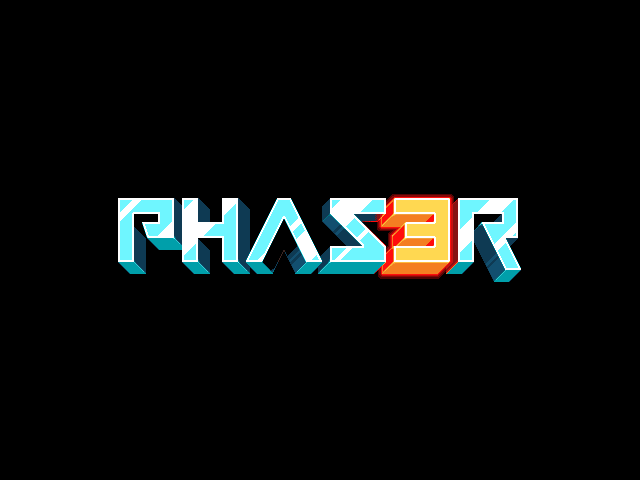

# [procedural-dungeon](http://procedural-dungeon.surge.sh)

Rogue like game.



---

## First steps
Installation with `yarn install` (or `npm install`)
Run your project with `yarn start` (or `npm start` if you prefer npm).

## Package Scripts

The following package scripts are also available to manage your project:

>   **HINT**: If you prefer npm, run these scripts with `npm run` instead.

```sh
yarn clean     # Manually deletes previous distribution files.
yarn dist      # Prepares the game for distribution.
yarn format    # Uses ESLint to format and remove lint issues.
yarn lint      # Checks scripts for lint issues using ESLint.
```

## Tutorial

No idea of what to do next? Follow this [tutorial][t] and learn more about
Phaser 3 and `generator-phaser-plus`.

[t]: https://github.com/rblopes/generator-phaser-plus#a-brief-tutorial

## Contributor

> [name](link-to-github-profile)
